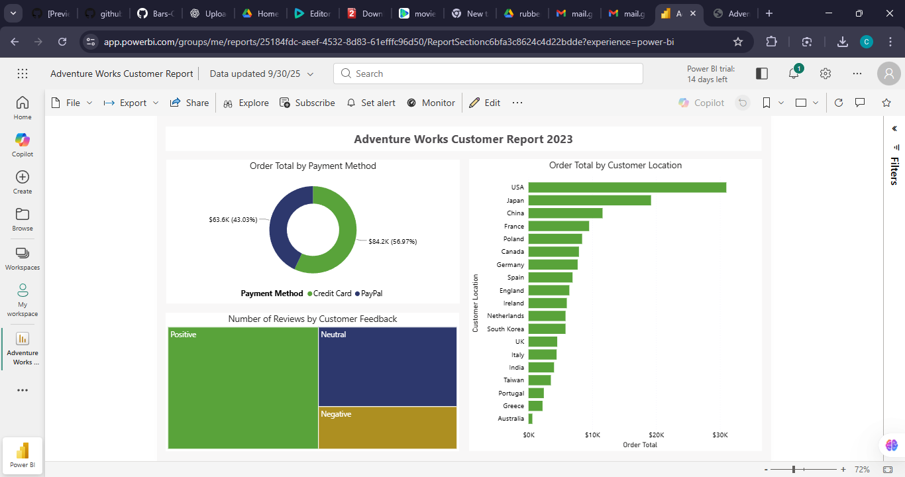

Adventure Works Customer Report 2023

This project features an interactive Power BI dashboard created as part of the Microsoft Power BI Professional Certificate.
The report analyzes customer behavior, order totals, payment methods, and customer feedback for the fictional Adventure Works company.

🖼️ Dashboard Preview

📊 Key Insights

USA ranks highest in total customer orders.
Credit Card is the most widely used payment method (56.97%).
Customer sentiment analysis reveals:
🟩 Positive feedback is the highest
🟦 Neutral responses form a good proportion
🟨 Negative feedback is the lowest

Regions such as Japan, China, France, Poland follow as strong contributors to total order value.

🧰 Tools Used

Power BI Desktop
Power Query (Data Cleaning & Transformation)
DAX (Data Modeling & Measures)
Power BI Service (Report Publishing)

📁 Files Included

Adventure_Works_Customer_Report_2023.pdf – Exported report (from Power BI Service)
Adventure_Works_Customer_Report_2023.png – Dashboard screenshot

📂 Project Description

This dashboard provides a high-level overview of customer order behavior, including:
Order totals by country
Order distribution by payment method
Customer feedback categories
Regional sales comparison
The report was created while completing the Microsoft Power BI Professional Certificate, focusing on real-world BI practices such as modeling, visualization, and insight communication.

🚀 Skills Demonstrated
Data modeling & DAX
Building interactive visuals
Drill-down & filtering
Using Power BI Service for publishing
Designing dashboards with business KPIs in mind
